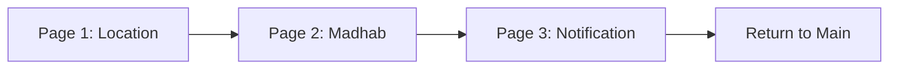

# Task 7 - Salat Waqt Onboarding Flow

## Overview
This task implements a unified onboarding flow for the Salat Waqt (Prayer Time) feature, combining all three individual onboarding screens into a single PageView-based flow with proper navigation and indicators.

## Architecture

### Key Components

1. **SwOnboardingFlowScreen** - Main flow controller with PageView
2. **SwOnboardingData** - Data model containing page information
3. **SwContentDisplay** - Dynamic content renderer for different page types
4. **SwPageIndicator** - Fixed position indicator that changes state per page
5. **Reusable Widgets** - All previously private classes are now public

### Features Implemented

✅ **Unified PageView Flow**: All 3 onboarding screens work together in a single flow  
✅ **Fixed Position Indicators**: Indicators stay in position but change state per page index  
✅ **Button Navigation**: Page changes only happen on button clicks (scroll disabled)  
✅ **Public Classes**: Maximum conversion of private classes to public for reusability  
✅ **State Management**: Proper handling of user selections (Madhab, notifications)  
✅ **Consistent Styling**: Same gradient background and styling throughout  

### Page Structure

```
SwOnboardingFlowScreen
├── Page 1: Location Permission
│   ├── Title: "Location"
│   ├── Subtitle: "Enable location permission"
│   ├── SVG Icon: swOnboarding1
│   ├── Description: Location permission explanation
│   └── Button: "Enable location permission"
├── Page 2: Madhab Selection
│   ├── Title: "Madhab"
│   ├── Subtitle: "(School of Thought)"
│   ├── SVG Icon: swOnboarding2
│   ├── Selection List: ["Hanafi", "Shafi, Maliki, Hambli"]
│   └── Button: "Continue"
└── Page 3: Notification Settings
    ├── Title: "Notification"
    ├── Subtitle: "Enable notifications to get updates"
    ├── SVG Icon: swOnboarding3
    ├── Toggle Card: Notification settings
    └── Button: "Continue"
```

### Indicator Behavior

The page indicators follow the specification:
- **Fixed Position**: Indicators remain at the same location on screen
- **State Changes**: Only the active indicator changes appearance per page index
- **Visual Feedback**: Active indicator is wider (80px) and highlighted, inactive ones are smaller (16px)

### Navigation Flow



## Usage

### Basic Implementation
```dart
import 'package:flutter/material.dart';
import 'task7/sw_onboarding_flow_screen.dart';

// Navigate to the onboarding flow
Navigator.push(
  context,
  MaterialPageRoute(
    builder: (context) => const SwOnboardingFlowScreen(),
  ),
);
```

### Available Public Widgets

All widgets are now public and reusable:

- `SwOnboardingFlowScreen` - Main flow screen
- `SwContentDisplay` - Content display component
- `SwGradientButton` - Gradient button widget
- `SwPageIndicator` - Page indicator component
- `SwIndicator` - Individual indicator dot
- `SwSelectableList` - Selectable list for Madhab
- `SwNotificationToggleCard` - Notification toggle card
- `SwCustomToggle` - Custom toggle switch

### Individual Page Widgets (Legacy Support)

The original individual page widgets are still available with public class names:
- `SwContentDisplay1`, `SwGradientButton1`, `SwPageIndicator1`, `SwIndicator1`
- `SwContentDisplay2`, `SwGradientButton2`, `SwPageIndicator2`, `SwIndicator2`, `SwSelectableList2`
- `SwContentDisplay3`, `SwGradientButton3`, `SwPageIndicator3`, `SwIndicator3`, `SwNotificationToggleCard3`, `SwCustomToggle3`

## Files Structure

```
task7/
├── models/
│   └── sw_onboarding_data.dart          # Data model for pages
├── onboardingScreen/
│   ├── sw_onboarding1.dart              # Legacy page 1 (now with public classes)
│   ├── sw_onboarding2.dart              # Legacy page 2 (now with public classes)
│   └── sw_onboarding3.dart              # Legacy page 3 (now with public classes)
├── sw_onboarding_flow_screen.dart       # Main unified flow screen
├── sw_onboarding_example.dart           # Usage example
└── README.md                            # This documentation
```

## Technical Implementation

### PageView Configuration
- **Physics**: `NeverScrollableScrollPhysics()` - Disables swipe navigation
- **Controller**: `PageController` for programmatic navigation
- **Item Count**: 3 pages (Location, Madhab, Notification)

### State Management
- Current page index tracking
- Madhab selection state
- Notification toggle state
- Status bar management

### Navigation Logic
```dart
void _nextPage() {
  if (_currentPageIndex < SwOnboardingData.pages.length - 1) {
    _pageController.nextPage(
      duration: const Duration(milliseconds: 300),
      curve: Curves.easeInOut,
    );
  } else {
    // Return to main menu
    Navigator.of(context).popUntil((route) => route.isFirst);
  }
}
```

## Dependencies

- `flutter/material.dart` - Material Design components
- `flutter/services.dart` - System UI management
- `flutter_svg/flutter_svg.dart` - SVG image rendering
- `../widgets/colors.dart` - Color definitions
- `../widgets/style.dart` - Style definitions
- `../widgets/images.dart` - Image asset paths

## Migration Guide

### From Individual Pages to Unified Flow

**Before:**
```dart
// Navigate to individual pages
Navigator.push(context, MaterialPageRoute(builder: (context) => SWonboarding1()));
Navigator.push(context, MaterialPageRoute(builder: (context) => SWonboarding2()));
Navigator.push(context, MaterialPageRoute(builder: (context) => SWonboarding3()));
```

**After:**
```dart
// Navigate to unified flow
Navigator.push(
  context, 
  MaterialPageRoute(builder: (context) => const SwOnboardingFlowScreen())
);
```

### Using Public Components

**Before:**
```dart
// Private classes - not accessible
_PageIndicator()  // ❌ Not accessible
_Indicator()      // ❌ Not accessible
```

**After:**
```dart
// Public classes - fully accessible
SwPageIndicator(currentPageIndex: 0)  // ✅ Accessible
SwIndicator(isActive: true)           // ✅ Accessible
```

## Benefits

1. **Unified Experience**: Single cohesive flow instead of separate screens
2. **Better UX**: Fixed indicators provide clear progress feedback
3. **Reusable Components**: All widgets are now public and reusable
4. **Maintainable Code**: Centralized flow management
5. **Consistent Navigation**: Button-only navigation prevents accidental swipes
6. **Backward Compatibility**: Original individual pages still work with public classes